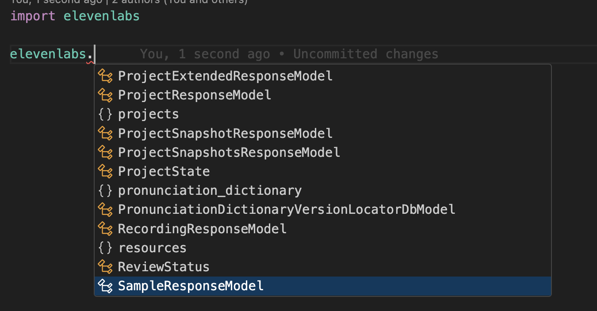

# ElevenLabs Python Library


[](https://buildwithfern.com/?utm_source=fern-elevenlabs/elevenlabs-python/readme)
[](https://discord.gg/elevenlabs)
[](https://twitter.com/elevenlabsio)
[](https://pypi.org/project/elevenlabs/)
[](https://pepy.tech/project/elevenlabs)

The official Python API for [ElevenLabs](https://elevenlabs.io/) [text-to-speech software.](https://elevenlabs.io/text-to-speech) Eleven brings the most compelling, rich and lifelike voices to creators and developers in just a few lines of code.

## 📖 API & Docs

Check out the [HTTP API documentation](https://elevenlabs.io/docs/api-reference).

## ⚙️ Install

```bash
pip install elevenlabs==v1.0.0b0
```

## v0.x to v1.x Migration Guide
> The SDK was rewritten in v1 and is now programatically generated from our OpenAPI spec. As part of this release 
> there are some breaking changes. 


### Client Instantiation
The SDK now exports a client class that you must instantiate to call various
endpoints in our API. 

```python
from elevenlabs.client import ElevenLabs

client = ElevenLabs(
  api_key="..." # Defaults to ELEVEN_API_KEY
)
```
As part of this change, there is no longer a `set_api_key` and `get_api_key` method exported. 

### HTTPX
The SDK now uses httpx under the hood. This allows us to export an async client in addition to 
a synchronous client. Note that you can pass in your own httpx client as well. 

```python
from elevenlabs.client import AsyncElevenLabs

client = AsyncElevenLabs(
  api_key="...",  # Defaults to ELEVEN_API_KEY
  httpx=httpx.AsyncClient(...)
)
```

### Removing Static Methods
There are no longer static methods exposed directly on objects. For example, 
instead of `Models.from_api()` you can now do `client.models.get_all()`. 

The renames are specified below: 

  `User.from_api()` -> `client.users.get()`

  `Models.from_api()` -> `client.models.get_all()`

  `Voices.from_api()` -> `client.voices.get_all()` 

  `History.from_api()` -> `client.history.get_all()` 


### Exported functions
The SDK no longer exports top level functions `generate`, `clone`, and `voices`. Instead, 
everything is now directly attached to the client instance. 

#### `generate` -> `client.generate`

The generate method is a helper function that makes it easier to consume the 
text-to-speech APIs. If you'd rather access the raw APIs, simply use `client.text_to_speech`. 

#### `clone` -> `client.clone`

The clone method is a helper function that wraps the voices add and 
get APIs. If you'd rather access the raw APIs, simply use `client.voices.add()`. 

#### `voice` -> `client.voices.get_all()` 

To get all your voices, use `client.voices.get_all()`. 

#### `play` and `stream`

The SDK continues to export the `play` and `stream` methods. Under the hood, these methods
use ffmpeg and mpv to play audio streams. 


## 🗣️ Usage
[](https://huggingface.co/spaces/elevenlabs/tts)
[](https://colab.research.google.com/gist/flavioschneider/49468d728a816c6538fd2f56b3b50b96/elevenlabs-python.ipynb)

We support two main models: the newest `eleven_multilingual_v2`, a single foundational model supporting 29 languages including English, Chinese, Spanish, Hindi, Portuguese, French, German, Japanese, Arabic, Korean, Indonesian, Italian, Dutch, Turkish, Polish, Swedish, Filipino, Malay, Russian, Romanian, Ukrainian, Greek, Czech, Danish, Finnish, Bulgarian, Croatian, Slovak, and Tamil; and `eleven_monolingual_v1`, a low-latency model specifically trained for English speech.

```py
from elevenlabs import play
from elevenlabs.client import ElevenLabs

client = ElevenLabs(
  api_key="YOUR_API_KEY", # Defaults to ELEVEN_API_KEY
)

audio = client.generate(
  text="Hello! 你好! Hola! नमस्ते! Bonjour! こんにちは! مرحبا! 안녕하세요! Ciao! Cześć! Привіт! வணக்கம்!",
  voice="Rachel",
  model="eleven_multilingual_v2"
)
play(audio)
```

<details> <summary> Play </summary>

<i> Don't forget to unmute the player! </i>

[audio (3).webm](https://github.com/elevenlabs/elevenlabs-python/assets/12028621/778fd3ed-0a3a-4d66-8f73-faee099dfdd6)

</details>

## 🗣️ Voices

List all your available voices with `voices()`.
```py
from elevenlabs import play
from elevenlabs.client import ElevenLabs

client = ElevenLabs(
  api_key="YOUR_API_KEY", # Defaults to ELEVEN_API_KEY
)

response = client.voices.get_all()
audio = generate(text="Hello there!", voice=response.voices[0])
print(voices)
```

<details> <summary> Show output </summary>

```py
[
  Voice(
      voice_id='21m00Tcm4TlvDq8ikWAM',
      name='Rachel',
      category='premade',
      settings=None,
  ),
  Voice(
      voice_id='AZnzlk1XvdvUeBnXmlld',
      name='Domi',
      category='premade',
      settings=None,
  ),
]
```

</details>

Build a voice object with custom settings to personalize the voice style, or call 
`client.voices.get_settings("your-voice-id")` to get the default settings for the voice.

```py
from elevenlabs import Voice, VoiceSettings, play
from elevenlabs.client import ElevenLabs

client = ElevenLabs(
  api_key="YOUR_API_KEY", # Defaults to ELEVEN_API_KEY
)

audio = generate(
    text="Hello! My name is Bella.",
    voice=Voice(
        voice_id='EXAVITQu4vr4xnSDxMaL',
        settings=VoiceSettings(stability=0.71, similarity_boost=0.5, style=0.0, use_speaker_boost=True)
    )
)

play(audio)
```

</details>

## Clone Voice

Clone your voice in an instant. Note that voice cloning requires an API key, see below.

```py
from elevenlabs.client import ElevenLabs
from elevenlabs import play

client = ElevenLabs(
  api_key="YOUR_API_KEY", # Defaults to ELEVEN_API_KEY
)

voice = client.clone(
    name="Alex",
    description="An old American male voice with a slight hoarseness in his throat. Perfect for news", # Optional
    files=["./sample_0.mp3", "./sample_1.mp3", "./sample_2.mp3"],
)

audio = client.generate(text="Hi! I'm a cloned voice!", voice=voice)

play(audio)
```

## 🚿 Streaming

Stream audio in real-time, as it's being generated.

```py
from elevenlabs.client import ElevenLabs
from elevenlabs import stream

client = ElevenLabs(
  api_key="YOUR_API_KEY", # Defaults to ELEVEN_API_KEY
)

audio_stream = client.generate(
  text="This is a... streaming voice!!",
  stream=True
)

stream(audio_stream)
```

Note that `generate` is a helper function. If you'd like to access
the raw method, simply use `client.text_to_speech.convert_as_stream`. 

### Input streaming
Stream text chunks into audio as it's being generated, with <1s latency. Note: if chunks don't end with space or punctuation (" ", ".", "?", "!"), the stream will wait for more text.
```py
from elevenlabs.client import ElevenLabs
from elevenlabs import stream

client = ElevenLabs(
  api_key="YOUR_API_KEY", # Defaults to ELEVEN_API_KEY
)

def text_stream():
    yield "Hi there, I'm Eleven "
    yield "I'm a text to speech API "

audio_stream = client.generate(
    text=text_stream(),
    voice="Nicole",
    model="eleven_monolingual_v1",
    stream=True
)

stream(audio_stream)
```

Note that `generate` is a helper function. If you'd like to access
the raw method, simply use `client.text_to_speech.convert_realtime`. 


## Async Client 
Use `AsyncElevenLabs` if you want to make API calls asynchronously. 

```python
import asyncio

from elevenlabs.client import AsyncElevenLabs

eleven = AsyncElevenLabs(
  api_key="MY_API_KEY" # Defaulsts to ELEVEN_API_KEY
)

async def print_models() -> None:
    models = await eleven.models.get_all()
    print(models)

asyncio.run(print_models())
```

## Elevenlabs module
All of the ElevenLabs models are nested within the elevenlabs module. 



## Languages Supported

We support 29 languages and 100+ accents. Explore [all languages](https://elevenlabs.io/languages).


## Contributing

While we value open-source contributions to this SDK, this library is generated programmatically. Additions made directly to this library would have to be moved over to our generation code, otherwise they would be overwritten upon the next generated release. Feel free to open a PR as a proof of concept, but know that we will not be able to merge it as-is. We suggest opening an issue first to discuss with us! 

On the other hand, contributions to the README are always very welcome!
